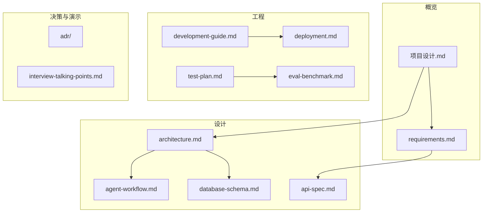

# BizMind 文档中心

> 本目录包含 BizMind 项目的完整设计与工程文档。编码前请先阅读 [项目设计](./项目设计.md) 与 [需求规格](./requirements.md)。

## 文档地图

## 文档清单

| 文档 | 类型 | 读者 | 说明 |
|------|------|------|------|
| [项目设计.md](./项目设计.md) | 总体设计 (SDD) | 全员 | 项目定位、技术选型、架构概要、里程碑 |
| [requirements.md](./requirements.md) | 需求规格 (SRS) | PM / 开发 | 功能需求、非功能需求、验收标准 |
| [architecture.md](./architecture.md) | 架构设计 | 开发 / 运维 | Mermaid 详图、组件职责、数据流 |
| [database-schema.md](./database-schema.md) | 数据库设计 | 后端 | ER 图、表结构、索引、迁移策略 |
| [api-spec.md](./api-spec.md) | 接口规范 | 前后端 | REST + SSE 约定、错误码、示例 |
| [agent-workflow.md](./agent-workflow.md) | Agent 设计 | AI / 后端 | LangGraph 节点、状态、Prompt、测试 |
| [development-guide.md](./development-guide.md) | 开发指南 | 开发 | 环境搭建、目录约定、提交规范 |
| [test-plan.md](./test-plan.md) | 测试计划 | QA / 开发 | 测试分层、用例矩阵、CI 策略 |
| [deployment.md](./deployment.md) | 部署运维 | 运维 / 演示 | Docker Compose、环境变量、故障排查 |
| [eval-benchmark.md](./eval-benchmark.md) | 评测基准 | AI / 面试 | Golden QA、RAGAS 流程、对比实验 |
| [interview-talking-points.md](./interview-talking-points.md) | 演示提纲 | 面试 | 叙事结构、高频 Q&A、Demo 脚本 |
| [decisions.md](./decisions.md) | 工程决策 | 开发 | 编码前锁定的实现决策 |
| [coding-standards.md](./coding-standards.md) | 编码规范 | 开发 | Python/TS 分层、命名、异常 |
| [p1-backlog.md](./p1-backlog.md) | P1 任务 | 开发 | Phase 1 拆解与 PR 顺序 |
| [adr/](./adr/) | 架构决策记录 | 架构师 | ADR-001 ~ ADR-005 |
| 根目录 [CONTRIBUTING.md](../CONTRIBUTING.md) | 协作 | 全员 | PR、DoD、文档同步 |

## 阅读顺序建议

### 新成员 onboarding

1. [项目设计](./项目设计.md) §1–2 — 了解背景与选型
2. [requirements.md](./requirements.md) — 明确做什么、不做什么
3. [development-guide.md](./development-guide.md) — 本地跑起来
4. [architecture.md](./architecture.md) + [api-spec.md](./api-spec.md) — 进入开发

### 后端 / RAG 开发

1. [database-schema.md](./database-schema.md)
2. [agent-workflow.md](./agent-workflow.md)
3. [test-plan.md](./test-plan.md) §3–4

### 面试 / Demo 准备

1. [interview-talking-points.md](./interview-talking-points.md)
2. [eval-benchmark.md](./eval-benchmark.md)
3. [deployment.md](./deployment.md) § Demo 检查清单

## 文档维护约定

- **版本号：** 与 [项目设计](./项目设计.md) 主版本对齐（当前 `v0.1-design`）
- **变更：** 结构性变更需更新本索引与项目设计 §11.2
- **语言：** 设计文档中文为主；`architecture.md` 保留英文标题便于对外展示
- **状态标记：** ✅ 已完成 · 🚧 随实现更新 · 📋 模板待填数据

## 修订记录

| 日期 | 说明 |
|------|------|
| 2026-06-14 | 补全开写前规范：CONTRIBUTING、decisions、coding-standards、P1 backlog、CI、脚手架 |
