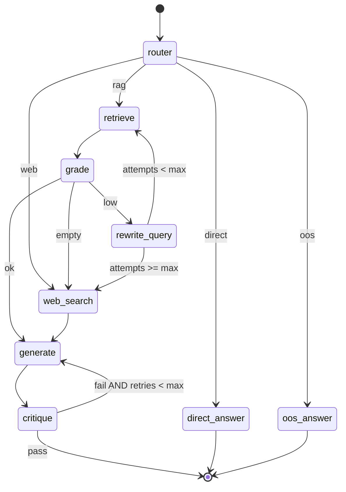

# BizMind — LangGraph Agent 工作流设计

> **版本：** v0.1  
> **框架：** LangGraph ≥ 0.2  
> **关联：** [architecture](./architecture.md) · [api-spec §6](./api-spec.md#6-对话模块sse)

---

## 1. 概述

Agent 子系统负责将用户问题路由到合适的处理路径，并在 RAG 路径上执行「检索 → 评判 → 生成 → 自检」的闭环。与 `rag/` 子系统严格分离：`agent/` 只编排，检索细节委托 `Retriever`。

### 1.1 设计目标

| 目标 | 实现 |
|------|------|
| 可测试 | 每个 node 纯函数化，mock LLM 断言边走向 |
| 可观测 | 每 node 注册 Langfuse span |
| 可对比 | Baseline 路径绕过本图 |
| 成本控制 | Router 分流 direct；Critique 用小模型 |

---

## 2. 状态定义

```python
from typing import Literal, TypedDict
from langchain_core.messages import BaseMessage

class ChunkRef(TypedDict):
    chunk_id: str
    document_id: str
    parent_id: str
    text: str
    source: str
    page: int | None
    score: float

class Citation(TypedDict):
    document_id: str
    chunk_id: str
    source: str
    page: int | None
    text_preview: str

class AgentState(TypedDict):
    messages: list[BaseMessage]
    query: str
    rewritten_query: str | None
    retrieved_chunks: list[ChunkRef]
    retrieval_score: float
    retrieval_attempts: int
    generation: str
    critique_passed: bool
    critique_feedback: str | None
    citations: list[Citation]
    route: Literal["direct", "rag", "web", "oos"]
    tenant_id: str
    thread_id: str
    web_search_results: list[dict] | None
```

### 2.1 状态字段说明

| 字段 | 写入节点 | 用途 |
|------|----------|------|
| `route` | router | 条件边入口 |
| `rewritten_query` | rewrite | 低质量检索后改写 |
| `retrieval_score` | grade | 0–1，阈值默认 0.5 |
| `retrieval_attempts` | retrieve | 上限 `MAX_RETRIEVAL_RETRIES` |
| `critique_passed` | critique | 是否结束或重试 generate |
| `citations` | generate | SSE citation 事件来源 |

---

## 3. 图结构



### 3.1 节点清单

| 节点 | 文件 | LLM 调用 | 说明 |
|------|------|----------|------|
| router | `nodes/router.py` | 是 | 意图分类 |
| retrieve | `nodes/retrieve.py` | 否 | 调用 Retriever |
| grade | `nodes/grade.py` | 是 | 评判检索相关性 |
| rewrite_query | `nodes/rewrite.py` | 是 | 查询改写 |
| web_search | `nodes/web_search.py` | 否 | Tavily API |
| generate | `nodes/generate.py` | 是 | 带引用生成 |
| critique | `nodes/critique.py` | 是 | 幻觉/遗漏检查 |
| direct_answer | `nodes/generate.py` | 是 | 无检索直答 |
| oos_answer | `nodes/generate.py` | 是 | 礼貌拒答 |

---

## 4. 条件边逻辑

### 4.1 router → next

```python
def route_after_router(state: AgentState) -> str:
    return {
        "direct": "direct_answer",
        "rag": "retrieve",
        "web": "web_search",
        "oos": "oos_answer",
    }[state["route"]]
```

**Router 分类规则（Prompt 约束）：**

| route | 条件示例 |
|-------|----------|
| direct | 问候、元问题（「你是谁」）、与文档无关的常识 |
| rag | 企业 SOP、制度、操作手册类问题 |
| web | 明确要求最新外部信息且文档不足 |
| oos | 违法、有害、完全超出产品范围 |

### 4.2 grade → next

```python
def route_after_grade(state: AgentState) -> str:
    chunks = state["retrieved_chunks"]
    score = state["retrieval_score"]
    if not chunks:
        return "empty"
    if score >= 0.5:
        return "ok"
    return "low"
```

映射：`ok → generate`，`low → rewrite_query`，`empty → web_search`（若启用）或 `oos_answer`。

### 4.3 rewrite → next

```python
def route_after_rewrite(state: AgentState) -> str:
    if state["retrieval_attempts"] >= MAX_RETRIEVAL_RETRIES:
        return "web_search" if WEB_SEARCH_ENABLED else "generate"
    return "retrieve"
```

### 4.4 critique → next

```python
def route_after_critique(state: AgentState) -> str:
    if state["critique_passed"]:
        return END
    if state.get("_critique_retries", 0) >= MAX_CRITIQUE_RETRIES:
        return END  # 带 warning 标记输出
    return "generate"
```

---

## 5. Prompt 模板规范

模板存放：`backend/app/agent/prompts/`

| 文件 | 用途 |
|------|------|
| `router.system.txt` | 路由系统 prompt |
| `grade.system.txt` | 检索相关性 JSON 输出 |
| `rewrite.system.txt` | 查询改写 |
| `generate.system.txt` | 带引用回答 |
| `generate.user.j2` | 用户问题 + 上下文 XML |
| `critique.system.txt` | 自检 JSON：`{passed, feedback}` |
| `oos.system.txt` | 拒答模板 |

### 5.1 上下文隔离（Prompt 注入防护）

```xml
<retrieved_context>
  <chunk id="..." source="his/manual.md" page="5">
    ... document text ...
  </chunk>
</retrieved_context>

<user_question>
  ... user input ...
</user_question>
```

规则：模型仅依据 `<retrieved_context>` 回答 factual 问题；若上下文不足，明确说明而非编造。

### 5.2 Grade 输出格式

```json
{
  "score": 0.85,
  "reason": "Chunks cover inventory SOP steps"
}
```

### 5.3 Critique 输出格式

```json
{
  "passed": false,
  "feedback": "Answer mentions weekly cycle but context says monthly"
}
```

---

## 6. 节点实现要点

### 6.1 retrieve

```python
async def retrieve_node(state: AgentState, retriever: Retriever) -> dict:
    query = state["rewritten_query"] or state["query"]
    chunks = await retriever.hybrid_search(
        query=query,
        tenant_id=state["tenant_id"],
        top_k=RETRIEVAL_TOP_K,
        rerank_top_k=RERANK_TOP_K,
    )
    return {
        "retrieved_chunks": chunks,
        "retrieval_attempts": state["retrieval_attempts"] + 1,
    }
```

### 6.2 generate

- 输入：messages 历史 + parent chunk 全文
- 输出：`generation` 字符串 + `citations` 列表
- 流式：通过 LangGraph `stream_mode="messages"` 或 callback 推送 token

### 6.3 web_search

- 调用 Tavily，结果写入 `web_search_results`
- 失败时降级：空结果仍进入 generate，prompt 说明「无网络结果」

---

## 7. 编译与调用

```python
from langgraph.graph import StateGraph, END

def build_agent_graph() -> CompiledGraph:
    g = StateGraph(AgentState)
    g.add_node("router", router_node)
    g.add_node("retrieve", retrieve_node)
    # ... other nodes
    g.set_entry_point("router")
    g.add_conditional_edges("router", route_after_router)
    g.add_conditional_edges("grade", route_after_grade)
    # ...
    return g.compile(checkpointer=...)  # optional for persistence
```

**ChatService 调用：**

```python
async for event in graph.astream(initial_state, stream_mode="updates"):
    yield map_to_sse(event)
```

---

## 8. Baseline 对照路径

`backend/app/rag/baseline.py`：

1. Embed query
2. Dense search top_k
3. Single LLM call（无 grade/critique/rewrite）

用于 `/chat/baseline/stream` 与 RAGAS `mode=baseline`。

---

## 9. 测试用例矩阵

| 用例 ID | 输入 | Mock 行为 | 期望路径 |
|---------|------|-----------|----------|
| AGT-01 | 「你好」 | router→direct | direct_answer → END |
| AGT-02 | SOP 问题，高相关 chunks | grade score 0.9 | retrieve → grade → generate → critique → END |
| AGT-03 | 模糊问题，低分 | grade 0.2 | retrieve → grade → rewrite → retrieve |
| AGT-04 | 无 chunks | grade empty | web_search → generate |
| AGT-05 | 幻觉答案 | critique fail | generate → critique → generate |
| AGT-06 | retrieval_attempts=2 仍低 | — | rewrite → web_search |
| AGT-07 | 文档外敏感请求 | router→oos | oos_answer → END |

测试文件：`backend/tests/unit/test_agent_nodes.py`、`test_agent_graph.py`

---

## 10. 可观测性

| Span 名 | 属性 |
|---------|------|
| `agent.router` | route, latency |
| `agent.retrieve` | top_k, chunk_count, attempts |
| `agent.grade` | score, reason |
| `agent.generate` | token_usage |
| `agent.critique` | passed, feedback |

Trace ID = `request_id`，与 structlog 关联。

---

## 11. 配置项

| 变量 | 默认 | 说明 |
|------|------|------|
| `MAX_RETRIEVAL_RETRIES` | 2 | rewrite 循环上限 |
| `MAX_CRITIQUE_RETRIES` | 1 | 重生成上限 |
| `GRADE_THRESHOLD` | 0.5 | grade 通过分 |
| `WEB_SEARCH_ENABLED` | true | 空检索是否 web |
| `CRITIQUE_MODEL` | 同 LLM 或更小 | 成本优化 |

---

## 12. 修订记录

| 版本 | 日期 | 说明 |
|------|------|------|
| v0.1 | 2026-06-14 | 初始 Agent 设计，含测试矩阵与 Prompt 规范 |
