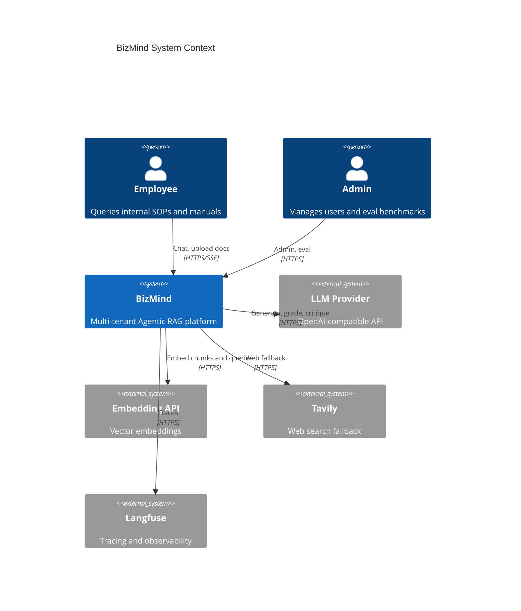
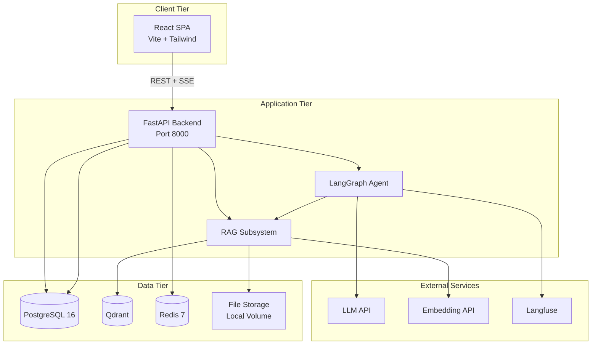
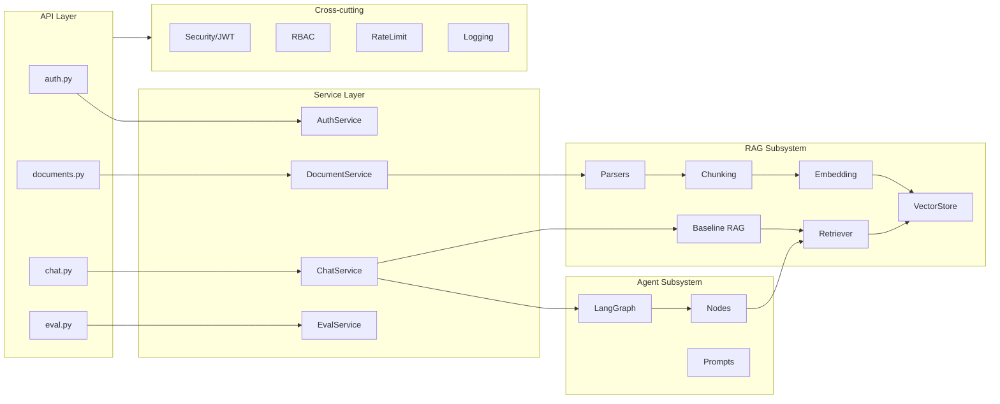
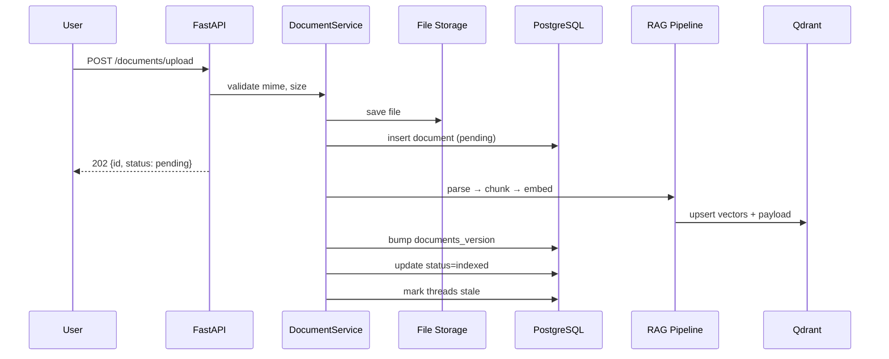
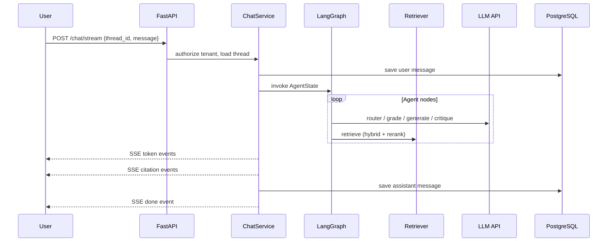
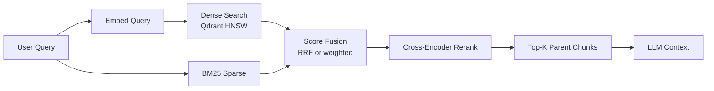
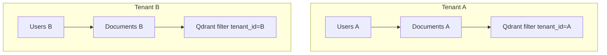
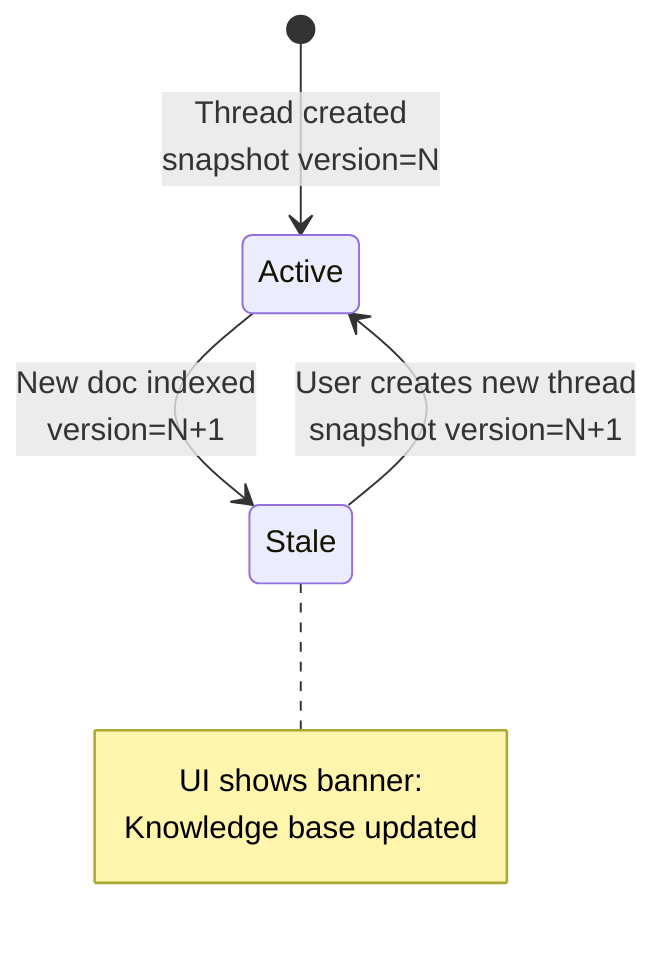
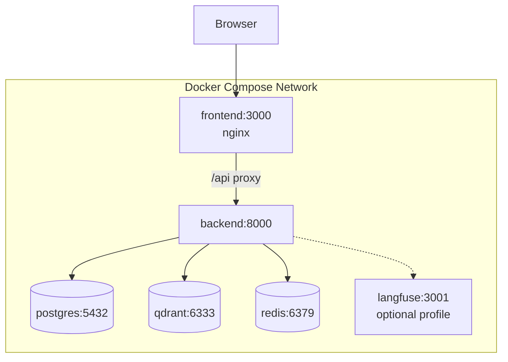

# BizMind — System Architecture

> **Version:** v0.1  
> **Status:** Design phase  
> **Related:** [项目设计](./项目设计.md) · [database-schema](./database-schema.md) · [agent-workflow](./agent-workflow.md)

---

## 1. Architecture Overview

BizMind is a multi-tenant Agentic RAG platform. The system separates **document ingestion**, **retrieval**, and **agent orchestration** into distinct layers with clear boundaries.

### 1.1 Quality Attributes

| Attribute | Target | Mechanism |
|-----------|--------|-----------|
| Isolation | Zero cross-tenant leakage | PG filter + Qdrant payload filter |
| Accuracy | RAGAS faithfulness ≥ 0.85 | Hybrid retrieval + rerank + Agent grade/critique |
| Latency | First token < 2s P95 | Streaming SSE, embedding cache, parallel I/O |
| Observability | End-to-end trace | Langfuse spans per Agent node |
| Reproducibility | Benchmark in README | Golden QA + RAGAS batch script |

---

## 2. C4 Context Diagram

---

## 3. Container Diagram

---

## 4. Backend Component Diagram

### 4.1 Layer Responsibilities

| Layer | Responsibility | Must NOT |
|-------|----------------|----------|
| `api/` | HTTP binding, auth deps, response mapping | Business logic, direct ORM in routes |
| `services/` | Use-case orchestration, transactions | LangGraph node logic |
| `rag/` | Parse, chunk, embed, retrieve | Agent routing decisions |
| `agent/` | State machine, LLM calls for workflow | Direct DB access (via injected services) |
| `core/` | Security, logging, rate limit | Domain rules |

---

## 5. Document Ingestion Flow

---

## 6. Chat / Agent Flow

---

## 7. Retrieval Pipeline

**Default parameters:**

| Parameter | Value |
|-----------|-------|
| Dense top_k | 20 |
| Sparse top_k | 20 |
| Fusion | RRF k=60 |
| Rerank top_k | 4 |
| Context | Parent chunks (2048 tokens each) |

---

## 8. Multi-Tenancy Model

**Defense in depth:**

1. JWT carries `tenant_id` claim
2. All PG queries include `WHERE tenant_id = :tenant_id`
3. Qdrant search always applies `must: [{ key: tenant_id, match: { value } }]`
4. Integration tests assert cross-tenant 404

---

## 9. Document Version Awareness

---

## 10. Deployment Topology (Docker Compose)

See [deployment.md](./deployment.md) for service definitions and volumes.

---

## 11. Technology Mapping

| Concern | Technology | Module |
|---------|------------|--------|
| HTTP API | FastAPI | `backend/app/api/` |
| Agent | LangGraph | `backend/app/agent/` |
| ORM | SQLAlchemy 2 async | `backend/app/models/` |
| Migrations | Alembic | `backend/alembic/` |
| Vector DB | qdrant-client | `backend/app/rag/vectorstore.py` |
| Cache | redis-py | `backend/app/core/rate_limit.py` |
| Frontend | React 19 + Vite | `frontend/src/` |
| Eval | RAGAS | `scripts/eval_rag.py` |

---

## 12. ADR Index

| ID | Title | Status |
|----|-------|--------|
| [ADR-001](./adr/001-langgraph-over-pipeline.md) | LangGraph over fixed pipeline | Accepted |
| [ADR-002](./adr/002-qdrant-over-chroma.md) | Qdrant over Chroma | Accepted |
| [ADR-003](./adr/003-parent-child-chunking.md) | Parent-Child chunking | Accepted |
| [ADR-004](./adr/004-document-version-threads.md) | Document version aware threads | Accepted |
| [ADR-005](./adr/005-baseline-rag-control.md) | Baseline RAG as control group | Accepted |

---

## 13. Revision History

| Version | Date | Description |
|---------|------|-------------|
| v0.1 | 2026-06-14 | Initial architecture with Mermaid diagrams |
