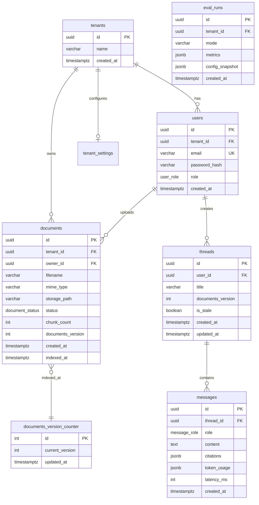

# BizMind — 数据库设计文档

> **版本：** v0.1  
> **DBMS：** PostgreSQL 16  
> **ORM：** SQLAlchemy 2.x + Alembic  
> **关联：** [项目设计 §5](./项目设计.md#5-领域模型) · [architecture](./architecture.md)

---

## 1. 概述

PostgreSQL 存储业务元数据、会话历史、评测结果；向量数据存 Qdrant；文件存对象存储。本文档仅描述 PostgreSQL schema。

### 1.1 设计原则

- **多租户：** 所有业务表含 `tenant_id`，应用层 + DB 索引双重保障
- **UUID 主键：** 避免分布式 ID 冲突，便于 API 暴露
- **时间戳：** 统一 `TIMESTAMPTZ`，默认 `now()`
- **软删除：** v1 文档物理删除；v1.1 可引入 `deleted_at`

---

## 2. ER 图



---

## 3. 枚举类型

```sql
CREATE TYPE user_role AS ENUM ('admin', 'user');
CREATE TYPE document_status AS ENUM ('pending', 'indexing', 'indexed', 'failed');
CREATE TYPE message_role AS ENUM ('user', 'assistant', 'system');
```

---

## 4. 表结构详述

### 4.1 tenants

| 列 | 类型 | 约束 | 说明 |
|----|------|------|------|
| id | UUID | PK, DEFAULT gen_random_uuid() | 租户 ID |
| name | VARCHAR(255) | NOT NULL | 租户名称 |
| created_at | TIMESTAMPTZ | NOT NULL, DEFAULT now() | |

**索引：** PRIMARY KEY (id)

**说明：** Demo 环境可预置单租户；注册时可自动创建 tenant。

---

### 4.2 users

| 列 | 类型 | 约束 | 说明 |
|----|------|------|------|
| id | UUID | PK | |
| tenant_id | UUID | FK → tenants(id), NOT NULL | 租户隔离 |
| email | VARCHAR(255) | NOT NULL | 登录名 |
| password_hash | VARCHAR(255) | NOT NULL | bcrypt |
| role | user_role | NOT NULL, DEFAULT 'user' | |
| created_at | TIMESTAMPTZ | NOT NULL, DEFAULT now() | |

**索引：**

```sql
CREATE UNIQUE INDEX uq_users_email ON users (email);
CREATE INDEX idx_users_tenant_id ON users (tenant_id);
```

---

### 4.3 documents

| 列 | 类型 | 约束 | 说明 |
|----|------|------|------|
| id | UUID | PK | |
| tenant_id | UUID | FK, NOT NULL | |
| owner_id | UUID | FK → users(id), NOT NULL | 上传者 |
| filename | VARCHAR(512) | NOT NULL | 原始文件名 |
| mime_type | VARCHAR(128) | NOT NULL | application/pdf 等 |
| storage_path | VARCHAR(1024) | NOT NULL | 相对存储路径 |
| status | document_status | NOT NULL, DEFAULT 'pending' | |
| chunk_count | INT | DEFAULT 0 | 索引 child chunk 数 |
| documents_version | INT | NOT NULL | 入库时的全局版本 |
| error_message | TEXT | NULL | 失败原因 |
| created_at | TIMESTAMPTZ | NOT NULL, DEFAULT now() | |
| indexed_at | TIMESTAMPTZ | NULL | 索引完成时间 |

**索引：**

```sql
CREATE INDEX idx_documents_tenant_created ON documents (tenant_id, created_at DESC);
CREATE INDEX idx_documents_tenant_status ON documents (tenant_id, status);
```

**状态流转：**

```
pending → indexing → indexed
                  ↘ failed
```

---

### 4.4 documents_version_counter

全局单例行，文档成功索引后递增。

| 列 | 类型 | 约束 | 说明 |
|----|------|------|------|
| id | INT | PK, DEFAULT 1 | 固定为 1 |
| current_version | INT | NOT NULL, DEFAULT 0 | 当前版本号 |
| updated_at | TIMESTAMPTZ | NOT NULL | 最后 bump 时间 |

**初始化：**

```sql
INSERT INTO documents_version_counter (id, current_version) VALUES (1, 0);
```

**Bump 逻辑（伪代码）：**

```python
async with session.begin():
    counter = await session.get_for_update(DocumentsVersionCounter, 1)
    counter.current_version += 1
    version = counter.current_version
    document.documents_version = version
    await mark_stale_threads(session, tenant_id, version)
```

---

### 4.5 threads

| 列 | 类型 | 约束 | 说明 |
|----|------|------|------|
| id | UUID | PK | |
| user_id | UUID | FK → users(id), NOT NULL | |
| title | VARCHAR(255) | NULL | 首条消息摘要 |
| documents_version | INT | NOT NULL | 创建时快照 |
| is_stale | BOOLEAN | NOT NULL, DEFAULT false | 知识库更新后标记 |
| created_at | TIMESTAMPTZ | NOT NULL, DEFAULT now() | |
| updated_at | TIMESTAMPTZ | NOT NULL, DEFAULT now() | |

**索引：**

```sql
CREATE INDEX idx_threads_user_updated ON threads (user_id, updated_at DESC);
```

**Stale 规则：** 当 tenant 内任一文档索引成功且 `documents_version > thread.documents_version` 时，将该 user 的所有未 stale thread 设为 `is_stale = true`（或仅同 tenant 的 thread）。

---

### 4.6 messages

| 列 | 类型 | 约束 | 说明 |
|----|------|------|------|
| id | UUID | PK | |
| thread_id | UUID | FK → threads(id) ON DELETE CASCADE | |
| role | message_role | NOT NULL | |
| content | TEXT | NOT NULL | |
| citations | JSONB | DEFAULT '[]' | 见下方 schema |
| token_usage | JSONB | NULL | `{prompt, completion, total}` |
| agent_trace | JSONB | NULL | 可选：route、retrieval_attempts |
| latency_ms | INT | NULL | 端到端延迟 |
| created_at | TIMESTAMPTZ | NOT NULL, DEFAULT now() | |

**citations JSONB schema：**

```json
[
  {
    "document_id": "uuid",
    "chunk_id": "uuid",
    "parent_id": "uuid",
    "source": "his/manual.md",
    "page": 12,
    "text_preview": "挂号流程..."
  }
]
```

**索引：**

```sql
CREATE INDEX idx_messages_thread_created ON messages (thread_id, created_at ASC);
```

---

### 4.7 tenant_settings（可选，P2）

| 列 | 类型 | 约束 | 说明 |
|----|------|------|------|
| tenant_id | UUID | PK, FK | |
| llm_model | VARCHAR(128) | NULL | 覆盖默认模型 |
| max_requests_per_minute | INT | DEFAULT 60 | |
| web_search_enabled | BOOLEAN | DEFAULT true | |
| updated_at | TIMESTAMPTZ | NOT NULL | |

---

### 4.8 eval_runs

| 列 | 类型 | 约束 | 说明 |
|----|------|------|------|
| id | UUID | PK | |
| tenant_id | UUID | FK, NOT NULL | |
| triggered_by | UUID | FK → users(id) | admin |
| mode | VARCHAR(32) | NOT NULL | `baseline` / `agent` |
| dataset_path | VARCHAR(512) | NOT NULL | golden_qa.jsonl |
| sample_count | INT | NOT NULL | |
| metrics | JSONB | NOT NULL | RAGAS 指标 |
| config_snapshot | JSONB | NOT NULL | chunk_size, top_k 等 |
| duration_sec | INT | NULL | |
| created_at | TIMESTAMPTZ | NOT NULL, DEFAULT now() | |

**metrics 示例：**

```json
{
  "faithfulness": 0.88,
  "answer_relevancy": 0.82,
  "context_precision": 0.79,
  "context_recall": 0.74
}
```

---

## 5. Qdrant Collection（交叉引用）

Collection：`bizmind_chunks`

| Payload 字段 | 类型 | 说明 |
|--------------|------|------|
| tenant_id | keyword | 租户隔离 filter |
| document_id | keyword | 关联 documents.id |
| chunk_id | keyword | child chunk UUID |
| parent_id | keyword | parent chunk UUID |
| chunk_type | keyword | `child` / `parent` |
| source | keyword | 文件名或路径 |
| page | integer | PDF 页码，MD 为 null |
| text_preview | text | 前 200 字预览 |
| documents_version | integer | 索引时版本 |

**删除文档时：** 按 `document_id` + `tenant_id` 删除 points。

---

## 6. Redis Key 设计

| Key 模式 | TTL | 用途 |
|----------|-----|------|
| `emb:{sha256(text)}` | 7d | Embedding 向量缓存 |
| `rl:user:{user_id}` | 1m | 用户级 rate limit 计数 |
| `rl:ip:{ip}` | 1m | IP 级 rate limit |
| `session:{thread_id}:summary` | 1h | 可选：长对话摘要缓存 |

---

## 7. 迁移策略

1. 初始迁移：`alembic revision --autogenerate -m "initial schema"`
2. 枚举变更：先 ADD VALUE，再改应用，最后 DROP OLD（PostgreSQL 限制）
3. 破坏性变更：仅 develop 分支；main 需兼容迁移路径
4. Seed：`scripts/seed_demo_docs.py` 不写入迁移，独立脚本

---

## 8. 修订记录

| 版本 | 日期 | 说明 |
|------|------|------|
| v0.1 | 2026-06-14 | 初始 schema，补充 tenants、eval_runs、version_counter |
